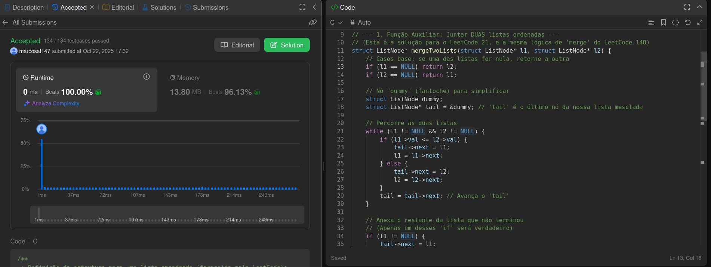
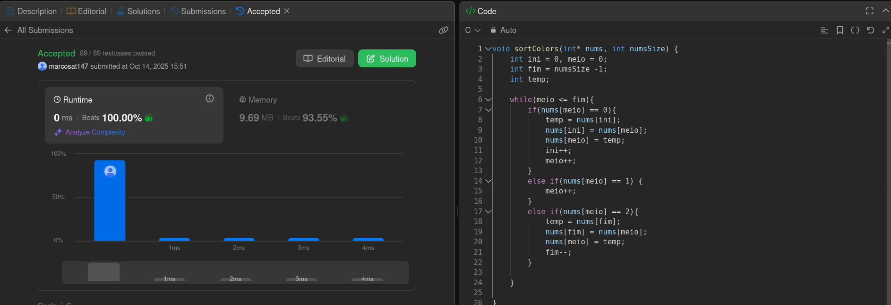
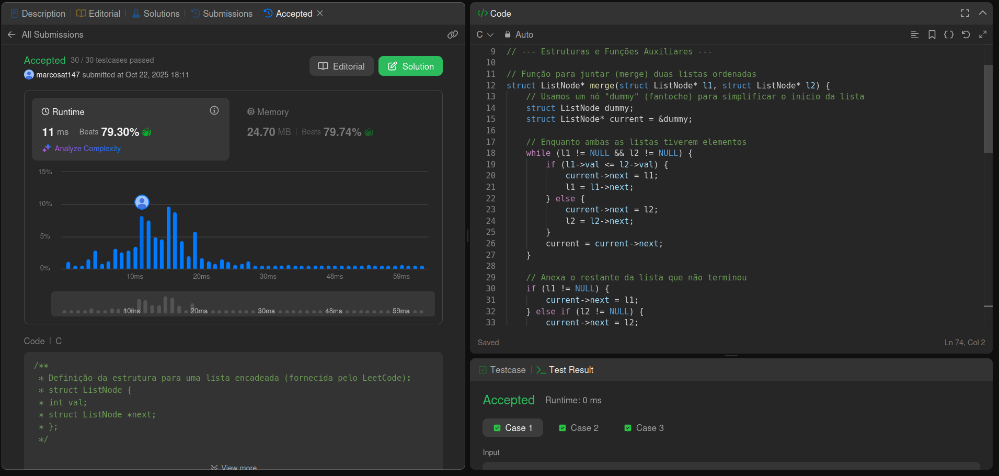

# Algoritmos de Ordenação em C

Este repositório contém a implementação de algoritmos de ordenação desenvolvidos como parte da disciplina de **Estruturas de Dados e Algoritmos II**.
Os códigos foram escritos em **C**, aplicados a problemas reais extraídos da plataforma **LeetCode**.

## Tema do Projeto

**Ordenação** – Algoritmos de ordenação aplicados a diferentes estruturas e cenários, com foco em eficiência, adaptabilidade e aplicação prática.

## Alunos

| Matrícula | Nome |
| --- | --- |
| 22/1008300 | Marcos Castilhos |

## Descrição do Projeto

Este projeto tem como objetivo explorar diferentes estratégias de ordenação, incluindo:

* A abordagem **Dividir para Conquistar (Merge Sort)**, demonstrada de duas formas:
    * Na ordenação de uma única lista encadeada (Problema 148: Sort List), dividindo a lista ao meio recursivamente.
    * Na mesclagem eficiente de $k$ listas pré-ordenadas (Problema 23: Merge k Sorted Lists), dividindo o array de listas de forma recursiva.
* Um algoritmo de **particionamento in-place (Dutch National Flag)**, utilizado para ordenar um array com três valores distintos (0, 1, 2) em uma única passagem e com espaço constante (Problema 75: Sort Colors).
* A implementação de funções auxiliares fundamentais, como `mergeTwoLists`, que serve de alicerce para as soluções baseadas em Merge Sort.

Os algoritmos foram aplicados a problemas da plataforma LeetCode em linguagem C.

## Problemas Resolvidos

| Problema | Linguagem | Dificuldade | Link |
| --- | --- | --- | --- |
| 23. Merge k Sorted Lists | C | Difícil | [Ver no LeetCode](https://leetcode.com/problems/merge-k-sorted-lists/description/) |
| 75. Sort Colors | C | Médio | [Ver no LeetCode](https://leetcode.com/problems/sort-colors/description/) |
| 148. Sort List | C | Médio | [Ver no LeetCode](https://leetcode.com/problems/sort-list/description/) |

> Todos os códigos foram rodados e testados diretamente no **LeetCode**, garantindo a validação automática em múltiplos casos de teste.

## Estrutura do Repositório

Cada problema está contido em sua própria pasta, que inclui o código-fonte em C e a captura de tela da submissão no LeetCode.

-   `23-merge-k-sorted-lists/`: Solução para o problema "Merge k Sorted Lists".
-   `75-sort-colors/`: Solução para o problema "Sort Colors".
-   `148-sort-list/`: Solução para o problema "Sort List".

## Análise das Soluções e Complexidade

Cada problema apresentou um desafio de ordenação único, exigindo uma abordagem específica para garantir a eficiência.

* **Problema 75 (Sort Colors):**
    * **Algoritmo:** A solução utiliza o algoritmo **Dutch National Flag (Bandeira Holandesa)**, uma abordagem de particionamento de três vias.
    * **Análise:** Em vez de usar um algoritmo de ordenação genérico como Quicksort ($O(n \log n)$) ou Counting Sort (que exigiria espaço $O(k)$), esta solução é otimizada para o cenário de apenas três valores distintos.
    * **Complexidade:** Ela alcança **Tempo $O(n)$** (pois percorre o array uma única vez) e **Espaço $O(1)$** (pois a ordenação é feita *in-place*, trocando elementos).

* **Problema 148 (Sort List):**
    * **Algoritmo:** A solução implementa o **Merge Sort Top-Down (Recursivo)**.
    * **Análise:** O Merge Sort é ideal para listas encadeadas. Diferente de arrays, listas não permitem acesso aleatório $O(1)$ (o que tornaria o Quicksort ineficiente). O Merge Sort, por outro lado, é eficiente em listas, pois a operação de "merge" (juntar) pode ser feita em $O(n)$ apenas manipulando ponteiros.
    * **Complexidade:** **Tempo $O(n \log n)$** e **Espaço $O(\log n)$** (devido à pilha de recursão para dividir a lista).

* **Problema 23 (Merge k Sorted Lists):**
    * **Algoritmo:** A solução usa uma abordagem de **Dividir e Conquistar**, similar ao Merge Sort.
    * **Análise:** A abordagem ingênua seria mesclar as listas uma por uma (lista 1 com a 2, resultado com a 3, etc.), o que levaria a um tempo de $O(k \cdot N)$ (onde $N$ é o número total de nós). Ao dividir o array de listas ao meio recursivamente e mesclar os resultados, reduzimos drasticamente a complexidade.
    * **Complexidade:** **Tempo $O(N \log k)$** (onde $N$ é o número total de nós e $k$ é o número de listas) e **Espaço $O(\log k)$** (devido à pilha de recursão).

## Como Executar

O código-fonte de cada problema está formatado como uma solução completa para a plataforma LeetCode.

1.  Navegue até a pasta do problema desejado (ex: `75-sort-colors/`).
2.  Abra o arquivo `.c` correspondente.
3.  Copie todo o conteúdo.
4.  Cole o código no editor da [página do problema correspondente no LeetCode](https://leetcode.com/problems/sort-colors/description/) e clique em "Run" ou "Submit".

## Capturas de Tela

Abaixo estão as imagens que demonstram o funcionamento dos algoritmos testados na plataforma LeetCode.

### 23 - Merge K Sorted Lists (C)

[Link para a submissão no leetcode](https://leetcode.com/problems/merge-k-sorted-lists/submissions/1808751056/)

### 75 - Sort Colors

[Link para a submissão no leetcode](https://leetcode.com/problems/sort-colors/submissions/1801540400/)

### 148 - Sort List

[Link para a submissão no leetcode](https://leetcode.com/problems/sort-list/submissions/1808787274/)

## Vídeo explicando os algoritmos

[Assista ao vídeo no YouTube](TODO)